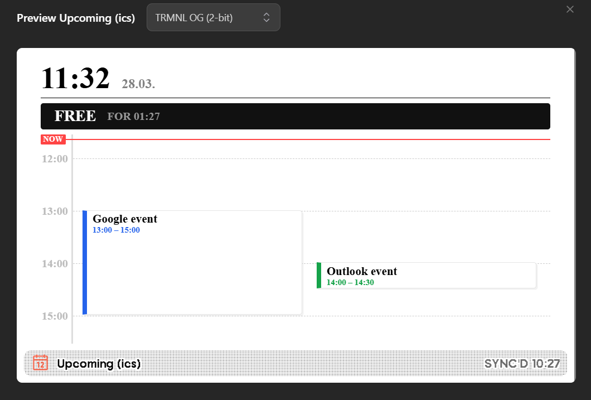

# Upcoming ICS Calendar for TRMNL

A clean, highly-glanceable calendar plugin for [TRMNL](https://usetrmnl.com). This plugin fetches events from your ICS feeds and displays them on a vertical timeline with a "Hero" status bar that tells you exactly how much free time you have left or when your current meeting ends.



## Features

- **Smart Hero Bar**: Displays "BUSY" with an end time or "FREE" with a countdown (Digital or Text format).
- **Dynamic Timeline**: A vertical schedule showing the next X hours of your day.
- **Multi-Source Coloring**: Support for two different calendar sources with custom labels and colors.
- **Multi-Day Awareness**: Automatically adds day labels (e.g., "Sun 17:30") for events spanning past midnight.
- **Flexible Layout**: Toggle between long and short date formats to fit half-screen or full-screen views.

## Installation

0. Gather your ics. Here is how I did it: [EWS -> CalDav + Google ICS -> TRMNL](https://github.com/paprika27/caldav_google_ics_to_trmnl)
1. Upload this recipe.

Alternatively to uploading/importing:
1. Create a new **Private Plugin** in your TRMNL Dashboard (or **Recipe** in your [Larapaper](https://github.com/usetrmnl/larapaper) install)
2. Set the **Data Source** to `CURL` or fill the poll URL with the correct URL (i.e. http://ical-proxy/events.json if you followed [EWS -> CalDav + Google ICS -> TRMNL](https://github.com/paprika27/caldav_google_ics_to_trmnl)).
3. Copy the contents of `*.liquid` into the **Template** section of your plugin and `settings.yml` into the settings field (in Larapaper, it's behind the dropdown next to Add to Playlist).

## Plugin Configuration

To enable the toggles and color settings, add the following to your plugin's **Settings** (YAML) configuration:

```yaml
-
  keyname: timezone_offset
  field_type: number
  name: 'Timezone Offset (Hours)'
  default: 1
-
  keyname: hours_to_show
  field_type: number
  name: 'Hours to show on Timeline'
  default: 6
-
  keyname: time_format_hm
  field_type: select
  name: 'Time Remaining Format'
  options:
    - '1H 15M': 'text'
    - '01:15': 'digital'
  default: 'text'
-
  keyname: date_format_short
  field_type: select
  name: 'Date Header Format'
  options:
    - 'Fri, 27 Mar': 'long'
    - '27.03.': 'short'
  default: 'long'
-
  keyname: source1_label
  field_type: text
  name: 'Calendar 1 Label'
  default: 'Work'
-
  keyname: source1_color
  field_type: color
  name: 'Calendar 1 Color'
  default: '#2563eb'
-
  keyname: source2_label
  field_type: text
  name: 'Calendar 2 Label'
  default: 'Personal'
-
  keyname: source2_color
  field_type: color
  name: 'Calendar 2 Color'
  default: '#16a34a'
```

## Data Structure

The recipe expects the following JSON structure from your `data` object (served like this by [EWS -> CalDav + Google ICS -> TRMNL](https://github.com/paprika27/caldav_google_ics_to_trmnl)):

```json
{
  "last_updated": "15:55",
  "events": [
    {
      "start": "2026-03-27T18:00:00Z",
      "end": "2026-03-27T18:30:00Z",
      "summary": "J visiting",
      "source": "Personal"
    }
  ]
}
```

## License

MIT © [paprika27](https://github.com/paprika27)
```
